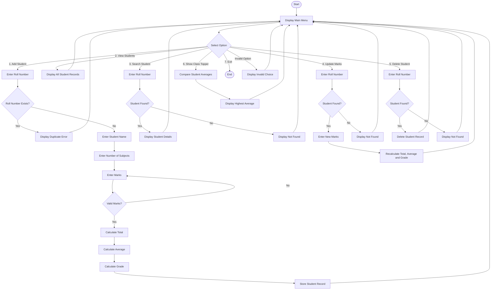

## Flowchart



# Student Grading System

A simple console-based Student Grading System developed in Python as a college programming project. The program is designed to manage student academic records through a menu-driven command-line interface. It allows users to add students, enter and manage their marks, calculate total and average marks, assign grades, search for students, update marks, delete records, and identify the class topper.

## Introduction

The Student Grading System is a Python-based application developed to simplify basic student record and grade management. Instead of manually calculating totals, averages, and grades, the program performs these calculations automatically based on the marks entered by the user.

The project demonstrates the use of fundamental Python programming concepts such as functions, dictionaries, sets, loops, conditional statements, input handling, validation, calculations, and menu-driven programming.

The application runs entirely through the command line or terminal and does not require any external Python libraries.

## Features

The Student Grading System provides several useful features for managing student records.

### Add Student

The user can add a new student by entering:

- Roll number
- Student name
- Number of subjects
- Marks for each subject

The program automatically calculates the student's total marks, average marks, and grade. It also checks whether the entered roll number already exists to prevent duplicate student records.

### View All Students

The program can display all currently stored student records in a table containing:

- Roll number
- Student name
- Total marks
- Average marks
- Grade

### Search Student

The user can search for a particular student by entering their roll number. If the student exists, the program displays their name, marks, total, average, and grade.

### Update Marks

The marks of an existing student can be updated. After new marks are entered, the program recalculates the total, average, and grade.

### Delete Student

A student's record can be deleted by entering their roll number.

### Show Class Topper

The program compares the average marks of all students and identifies the student with the highest average.

### Grade Calculation

Grades are assigned according to the student's average marks:

| Average Marks | Grade |
|---------------|-------|
| 90 - 100 | A+ |
| 80 - 89 | A |
| 70 - 79 | B |
| 60 - 69 | C |
| 50 - 59 | D |
| 40 - 49 | E |
| Below 40 | F |

## Technologies Used

- Python
- Command Line / Terminal
- Python Dictionary
- Python Set
- Git
- GitHub

No external Python libraries are required to run the project.

## Installation

Before running the project, make sure Python is installed on your computer.

To check the installed version of Python, open Command Prompt or Terminal and enter:

```bash
python --version


Start
  |
  v
Display Main Menu
  |
  v
Select an Option
  |
  +----------------------+
  |                      |
  v                      v
Add Student          View Students
  |                      |
  v                      v
Enter Details        Display Records
  |                      |
  v                      |
Calculate Total          |
  |                      |
  v                      |
Calculate Average        |
  |                      |
  v                      |
Calculate Grade          |
  |                      |
  +----------+-----------+
             |
             v
        Return to Menu
             |
             v
       Select Another
          Option
             |
             v
           Exit

========================================
 STUDENT GRADE MANAGEMENT SYSTEM
========================================
1. Add Student
2. View All Students
3. Search Student
4. Update Marks
5. Delete Student
6. Show Class Topper
7. Exit

Enter your choice (1-7): 1

Enter roll number: 101
Enter student name: Rahul
How many subjects? 3

  Enter marks for subject 1: 85
  Enter marks for subject 2: 90
  Enter marks for subject 3: 80

Student Rahul added successfully. Grade: A


========================================
 STUDENT GRADE MANAGEMENT SYSTEM
========================================
1. Add Student
2. View All Students
3. Search Student
4. Update Marks
5. Delete Student
6. Show Class Topper
7. Exit

Enter your choice (1-7): 2

Roll      Name           Total     Average   Grade
-------------------------------------------------------
101       Rahul          255       85.00     A


Enter your choice (1-7): 3

Enter roll number to search: 101

Name    : Rahul
Marks   : [85.0, 90.0, 80.0]
Total   : 255.0
Average : 85.0
Grade   : A


Enter your choice (1-7): 6

Class Topper: Rahul (Roll: 101), Average: 85.0


Enter your choice (1-7): 7

Exiting program. Goodbye!
